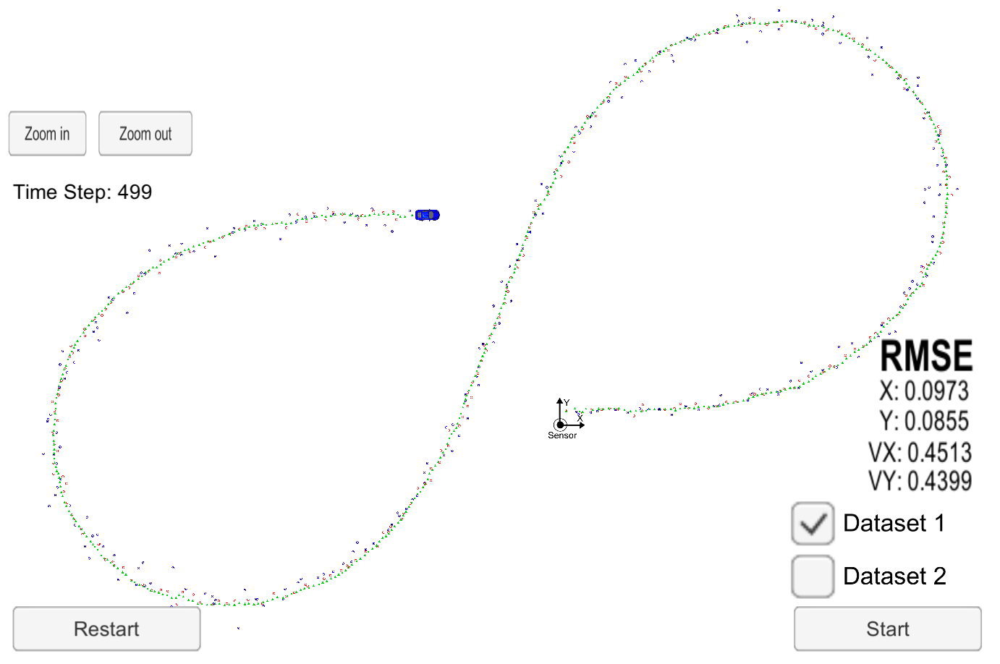

# Extended Kalman Filter Project Starter Code
Self-Driving Car Engineer Nanodegree Program

---

## Basic Build Instructions

1. Clone this repo.
2. Make a build directory: `mkdir build && cd build`
3. Compile: `cmake .. && make` 
   * On windows, you may need to run: `cmake .. -G "Unix Makefiles" && make`
4. Run it: `./ExtendedKF `

### Dependencies

* cmake >= 3.5
* make >= 4.1 (Linux, Mac), 3.81 (Windows)
* gcc/g++ >= 5.4

## Description

This is an implementation of Kalman and extended Kalman filters for tracking an object using radar and lidar measurements.

I have used the provided code template and reused the functions implemented in the lessons.

## Results

The extended Kalman Filter is able to track the object in the simulator.

The RMSE satisfies the rubric limits with following score on the first dataset:

- px: 0.0973 < 0.11
- py: 0.0855 < 0.11
- vx: 0.4513 < 0.52
- vy: 0.4399 < 0.52

The screenshot after running the algorithm on dataset 1:

## Conclusion

